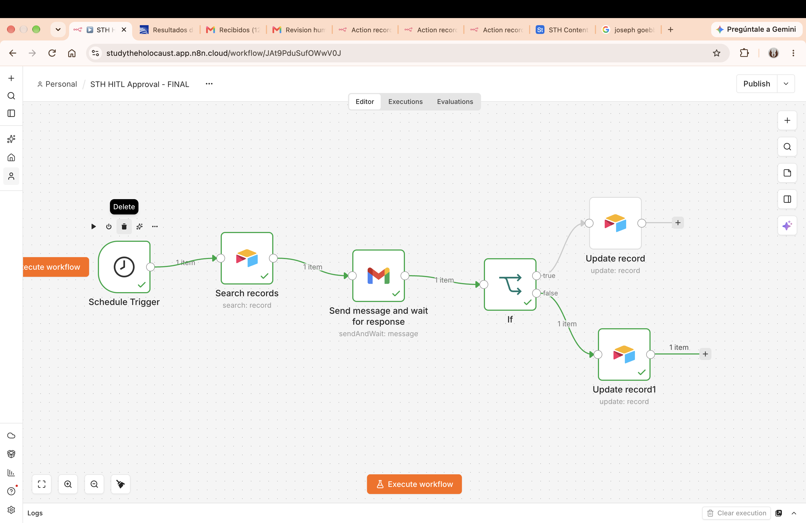
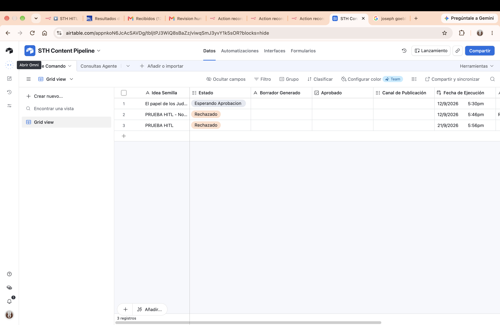

# Evidencia final - HITL rechazo

## Descripción

Esta evidencia corresponde al workflow `STH HITL Approval - FINAL`, validando el recorrido de rechazo humano dentro del punto Human-in-the-loop.

## Ejecución validada

- Ejecución n8n: `11595`
- Estado: `Succeeded`
- Decisión humana: rechazado
- Resultado en Airtable: estado `Rechazado` y aprobación desactivada

## Recorrido validado

`Schedule Trigger → Search records → Send message and wait for response → If → Update record1`

## Resultado

El flujo tomó un registro en revisión, envió la solicitud de validación humana, recibió una decisión de rechazo y actualizó Airtable con el estado final correspondiente.

## Evidencias visuales

### Workflow

### Airtable

## Componentes validados

- Rama FALSE del workflow HITL.
- Actualización de estado en Airtable.
- Control humano antes de confirmar una acción sensible.
